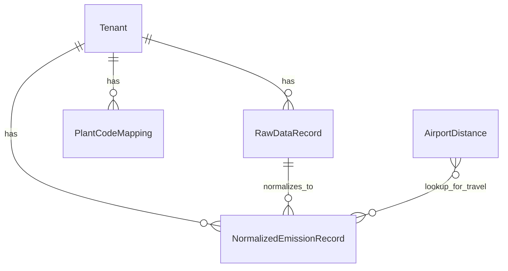

# Data Model

## Overview

## Entities

### Tenant

Client isolation boundary. All queries filter by `tenant_id` resolved from `client_id` (API header `X-Client-Id`).

### RawDataRecord (immutable)

| Field | Type | Notes |
|-------|------|-------|
| tenant | FK | Required |
| source_type | enum | SAP / UTILITY / TRAVEL |
| payload | JSON | `{ "rows": [...], "row_count": N }` — exact parsed upload |
| filename, content_type | string | Audit metadata |
| checksum | SHA256 | Of canonical JSON payload |
| ingested_at | datetime | Auto |

**Immutability:** `save()` raises if `pk` already exists. No updates or deletes via application logic (admin is read-only for payload).

### NormalizedEmissionRecord (main table)

| Field | Type | Notes |
|-------|------|-------|
| tenant, raw_record | FK | Traceability |
| source_type, scope, status | enums | Status: PENDING / APPROVED / REJECTED |
| activity_date | date | Normalized activity period |
| category, description, location | text | Analyst-facing summary |
| quantity_raw, unit_raw | decimal, string | As ingested |
| quantity_normalized, unit_normalized | decimal, string | kWh / L / km / currency |
| quality_flags | JSON array | MISSING_FIELD, INVALID_UNIT, SUSPICIOUS_VALUE |
| normalized_payload | JSON | Unified schema snapshot |
| source_row_index | int | Index into `raw_record.payload.rows` |
| reviewed_at, reviewed_by, review_notes | audit | Set on approve/reject |
| edited_flag | bool | Reserved for manual corrections |

### Lookup tables

- **PlantCodeMapping** — SAP plant code → display name (per tenant)
- **AirportDistance** — IATA pair → km (global seed data)

## Scope assignment

| Source | Category | Scope |
|--------|----------|-------|
| SAP | fuel | SCOPE_1 |
| SAP | procurement (spend, no fuel qty) | SCOPE_3 |
| Utility | electricity | SCOPE_2 |
| Travel | flight, hotel, ground | SCOPE_3 |

## Traceability: raw → normalized

1. Each ingest creates one `RawDataRecord` with full row array.
2. Each row produces one `NormalizedEmissionRecord` with `source_row_index`.
3. Detail API exposes `raw_row` (single row) and `normalized_payload` side by side.
4. `raw_record.checksum` verifies payload integrity.

## Unit normalization

| Target | Accepted inputs |
|--------|-----------------|
| kWh | kWh, MWh (×1000) |
| L (liters eq.) | L, liters, gal (×3.78541), kg (1:1 demo) |
| km | km, miles (×1.60934); flights via airport table |
